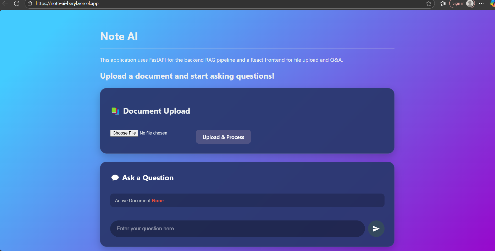
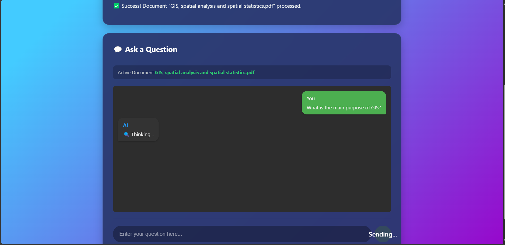
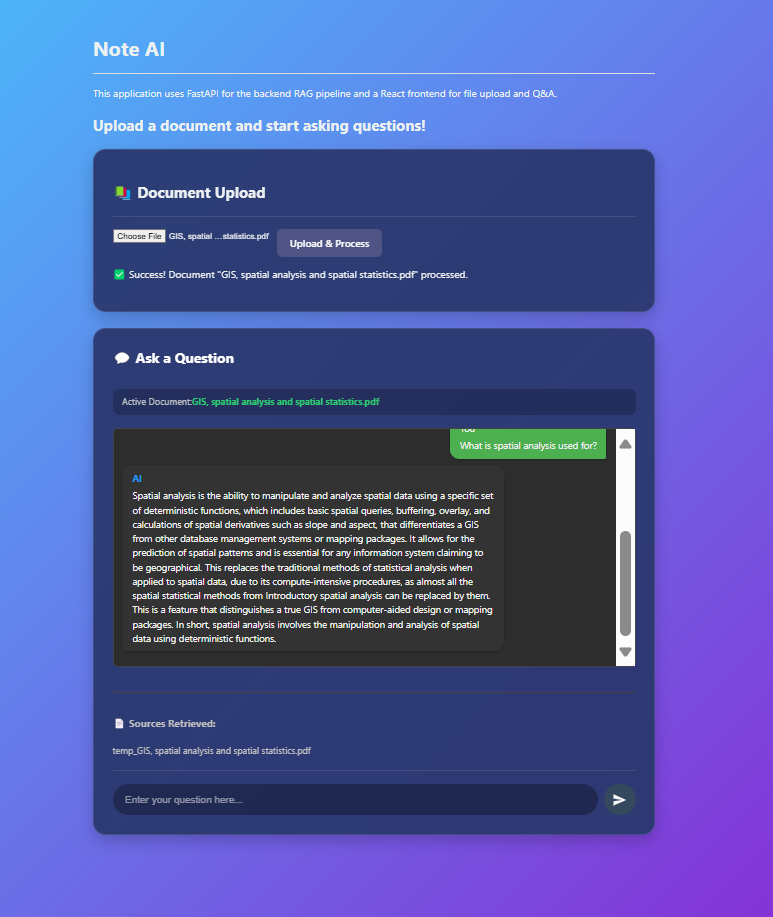
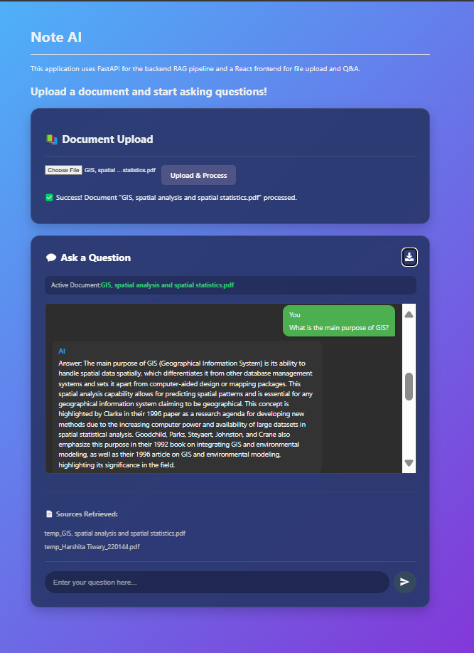
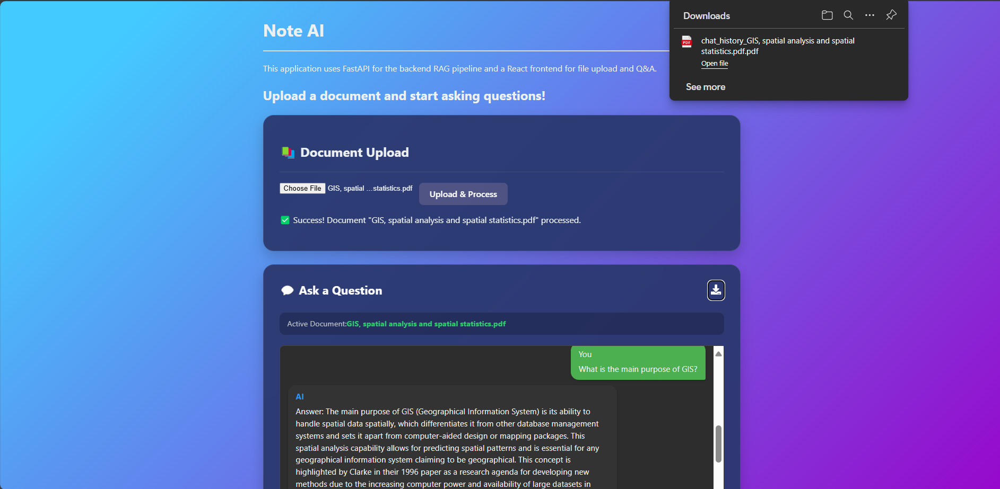

# 📘 Note AI

> **A Document-Based Question Answering (RAG) System built with FastAPI, LangChain, and React.**

**Note AI** allows you to upload multiple documents (PDF, DOCX, TXT), extract knowledge, and ask natural language questions about the content. The backend retrieves relevant chunks using vector search and generates accurate answers using Large Language Models (LLMs).

---

## 📸 Screenshots

| Dashboard | Q&A Interface | Chat History | Download Button | Downloaded PDF Preview |
|:---:|:---:|:---:|:---:|:---:|
|  |  |  | |  |

---

## 🚀 Features

### 🔹 Frontend (React + Vite)
* **Clean UI:** Modern interface for uploading PDF, DOCX, or TXT files.
* **Interactive Chat:** Real-time chat-style Q&A interface.
* **History Tracking:** Sidebar displays chat history and previous model responses.
* **Feedback:** Loading indicators, error handling, and smooth icons (React Icons).
* **Configurable:** Environment-based API configuration.

### 🔹 Backend (FastAPI + LangChain)
* **Document Parsing:** Robust file upload endpoint supporting PDF & DOCX text extraction.
* **Vector Search:** Embedding generation and indexing using **FAISS** or **Chroma**.
* **RAG Pipeline:** Retrieval-Augmented Generation for accurate, context-aware answers.
* **Contextual Memory:** Chat history support for follow-up queries.
* **Model Flexibility:** Support for custom models (Mistral, Llama, Qwen, Zephyr).

---

## 🤖 Supported Models

Note AI leverages Hugging Face models for embeddings and text generation:

* **Embeddings:** `sentence-transformers/all-MiniLM-L6-v2`
* **LLM:** `HuggingFaceH4/zephyr-7b-beta`

---

## 📂 Project Structure

```text
Note AI/
│
├── 📁 Client/                  # Frontend (React + Vite)
│   ├── 📂 public/
│   ├── 📂 src/
│   │   ├── 🖼️ assets/
│   │   │   └── 📸 screenshots/
│   │   ├── 🧩 components/
│   │   │   ├── 📄 FileUpload.jsx
│   │   │   ├── 📄 QnA.jsx
│   │   │   └── 📄 ChatHistoryDisplay.jsx
│   │   ├── ⚛️ App.jsx
│   │   ├── 🎨 App.css
│   │   ├── ⚛️ main.jsx
│   │   ├── 🎨 index.css
│   │   └── 🎨 QnA.css
│   ├── ⚙️ vite.config.js
│   ├── 🧾 package.json
│   └── 🌐 index.html
│
└── 🖥️ Server/                  # Backend (FastAPI)
    ├── 🐍 main.py
    ├── 🧠 rag_pipeline.py
    ├── 📦 models/
    ├── 📂 uploads/
    ├── 🧠 vectorstore/
    ├── 🧾 requirements.txt
    └── 🔒 .env
```
🛠️ Installation & Setup
Follow these steps to run the project locally.

1. Clone the repository

git clone [https://github.com/your-username/note-ai.git](https://github.com/your-username/note-ai.git)
cd note-ai

# 🧠 Backend Setup (FastAPI)
Navigate to the server directory and set up the Python environment.

## 1. Navigate to Server
cd Server

## 2. Create virtual environment
python -m venv venv

## 3. Activate virtual environment
### Mac/Linux:
source venv/bin/activate
### Windows:
venv\Scripts\activate

## 4. Install dependencies
pip install -r requirements.txt

## 5. Setup Environment Variables
 Create a .env file in the Server directory and add your keys (if required by specific models)

 HUGGINGFACEhub_API_TOKEN=your_token_here

## 6. Run the server
uvicorn main:app --reload --host 0.0.0.0 --port 8000
The Backend will be running at: http://localhost:8000

# 💻 Frontend Setup (React)
Open a new terminal, navigate to the client directory, and start the UI.


## 1. Navigate to Client
cd ../Client

## 2. Install dependencies
npm install

## 3. Configure Environment
Create a .env file in the Client directory:
echo "VITE_RENDER_API_URL=http://localhost:8000"  .env

## 4. Run the app
npm run dev<br>
The Frontend will be running at: http://localhost:5173

# 🧪 Usage Workflow
Start the Backend: Ensure the FastAPI server is running.

Start the Frontend: Ensure the React app is running.

Upload Documents: Use the "Upload" button to select PDF, DOCX, or TXT files.

Processing: The system will extract text, create embeddings, and store them in the vector database.

Ask Questions: Type your query in the chat input.

Get Answers: The AI will retrieve relevant context and generate an answer with sources displayed below.

# 🤝 Contributing
Contributions are welcome! Please fork the repository and create a pull request.

# 📄 License
MIT License
